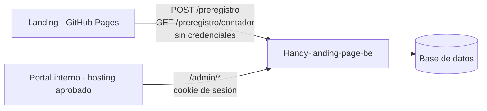

# Contrato de Handy-landing-page-be

**Estado: propuesta, sin aprobar y sin implementar.** El repositorio `Handy-landing-page-be` está vacío. Este documento fija lo que ya esperan los dos frontends, para construir el backend sin adivinar. La parte pública (`/preregistro`) ya la usa la landing. La parte administrativa (`/admin/*`) requiere TECH-03, TECH-06 y TECH-08 antes de exponer datos reales.

## Clientes y configuración



| Cliente | Variable | Dónde se define | Vacía significa |
|---|---|---|---|
| Landing | `VITE_FORM_ENDPOINT` | Variable `FORM_ENDPOINT` del repo (`.github/workflows/deploy.yml`) o `.env.local` | Formulario en "Registro habilitado en breve", sin pedidos |
| Portal | `VITE_API_BASE_URL` | Build del hosting operativo o `.env.local`. **Nunca en el deploy de GitHub Pages** (TECH-31) | `PendingPortalDataSource`, sin pedidos |
| Portal (solo dev) | `API_PROXY_TARGET` | `.env.local`; Vite reenvía `/api/*` a esa URL | Sin proxy |

Ambas URLs van sin barra final. Para desarrollar el portal contra el backend local: `VITE_API_BASE_URL=/api` y `API_PROXY_TARGET=http://localhost:3000`.

## Endpoints públicos (landing)

Esquema de referencia: `Handy-landing-page-fe/src/schema/preregistro.ts`. El backend usa una **copia sincronizada** y vuelve a validar todo.

### `POST /preregistro`

Cuerpo: `preregistroSchema` (unión por `tipo`):

```json
{ "tipo": "especialista", "nombre": "Ana P.", "email": "ana@example.com", "whatsapp": "223 000-0001",
  "rubros": ["gas"], "zona": "Centro", "cuit": "si", "acepta": true }
```

```json
{ "tipo": "usuario", "nombre": "Ana P.", "email": "ana@example.com", "barrio": "La Perla",
  "whatsapp": "223 000-0001", "necesidad": "Arreglar una pérdida" }
```

En usuario, `whatsapp` y `necesidad` son opcionales y llegan solo si se completaron. Usuario también manda `acepta: true`.

| Respuesta | Cuándo | Qué hace la landing |
|---|---|---|
| `201 { "ok": true }` | Guardado | Muestra éxito |
| `201 { "ok": true }` | `sitio_web` (honeypot) con contenido: **no se guarda** | Muestra éxito |
| `400 { "error": "validacion", "campos": ["email"] }` | La validación del servidor rechaza campos | Marca esos campos con los textos de `registro.json` |
| `429 { "error": "limite" }` | Demasiados envíos desde el mismo origen | Error genérico con "Reintentar" |
| `5xx` | Falla del servidor | Error genérico; los datos quedan en el formulario |

El servidor guarda además `id`, `creadoEn` (hora del servidor, ISO 8601 con zona), la aceptación de privacidad con su fecha y, para especialistas, `etapa: "identificado"` y `eventos: []`.

Pendiente de decidir: qué hacer con un email repetido del mismo `tipo`. Propuesta: no duplicar y responder `201` igual, para no revelar si alguien ya está anotado.

### `GET /preregistro/contador`

`200 { "usuarios": 37, "especialistas": 4 }`. Cacheable unos 60 s. La landing muestra el número solo si llega a `CONTADOR_MINIMO` (20).

### CORS público

`Access-Control-Allow-Origin` solo con el origen de la landing (`https://toti-gauna.github.io` hoy), métodos `GET, POST, OPTIONS`, header `Content-Type`, **sin** `Allow-Credentials`.

## Endpoints administrativos (portal)

Esquemas de referencia: `handy-internal-portal/src/contracts/landing-api.ts`. El portal valida cada respuesta con zod: una respuesta con otra forma se muestra como error y no llega a la pantalla.

### Autenticación y autorización (TECH-08, pendiente)

- Toda ruta `/admin/*` exige una sesión de personal autorizado verificada en servidor, y cada endpoint verifica el permiso (TECH-06).
- Propuesta: cookie de sesión `HttpOnly; Secure; SameSite=Lax`, emitida por el backend. El portal manda `credentials: "include"` y no guarda tokens en el navegador.
- Para que `SameSite=Lax` funcione, el portal y el backend tienen que compartir el mismo sitio, por ejemplo subdominios del mismo dominio. En desarrollo lo resuelve el proxy de Vite.
- CORS admin: solo el origen del portal, con `Access-Control-Allow-Credentials: true`. Nunca el origen de la landing.

### Errores

Cuerpo `{ "error": "<código>" }` sin detalles internos. El portal los traduce a mensajes propios:

| Estado | Uso |
|---|---|
| `400` / `422` | Parámetros o cuerpo inválidos |
| `401` | Sin sesión o sesión vencida |
| `403` | Sin permiso |
| `404` | El registro no existe |
| `409` | Transición de etapa no permitida |

### `GET /admin/preregistros/resumen`

Alimenta el Inicio y la insignia de "para contactar".

```json
{
  "especialistas": 14,
  "usuarios": 11,
  "porEstado": { "todos": 13, "sin_contactar": 6, "con_intentos": 3, "contactado": 2, "comprometido": 2 },
  "porRubro": { "electricidad": 4, "plomeria": 4, "gas": 3 },
  "cola": [ /* hasta 5 PreregistroEspecialista */ ]
}
```

- `porEstado` cuenta solo los pre-registros que siguen en pre-registro, sin `especialistaId`.
- `porRubro` puede omitir rubros en 0.
- `cola` sigue este orden: primero el seguimiento más próximo y, después, el pre-registro más antiguo sin contactar o con intentos.

### `GET /admin/preregistros?tipo=especialista`

Parámetros opcionales: `q` (nombre, zona, email o WhatsApp, también sin formato), `rubro`, `cuit`, `contacto` (`sin_contactar` · `con_intentos` · `contactado` · `comprometido`), `orden` (`recientes` · `antiguos`), `page` (desde 1) y `pageSize` (máximo 50).

```json
{ "rows": [ /* PreregistroEspecialista */ ], "total": 14, "page": 1, "pageSize": 8, "totalPages": 2,
  "porEstado": { "todos": 14, "sin_contactar": 6, "con_intentos": 3, "contactado": 2, "comprometido": 3 } }
```

`porEstado` usa los mismos filtros, salvo `contacto`, para las pestañas de estado.

### `GET /admin/preregistros?tipo=usuario`

Parámetros: `q` (nombre, barrio, necesidad o **email**, para atender pedidos de baja), `orden`, `page` y `pageSize`. Las filas **no incluyen** `email` ni `whatsapp`:

```json
{ "id": "…", "tipo": "usuario", "nombre": "Claudia R.", "barrio": "La Perla", "necesidad": "…",
  "creadoEn": "2026-10-05T10:05:00-03:00", "dejoWhatsapp": false }
```

### `GET /admin/preregistros/:id`

Devuelve un `PreregistroEspecialista` o un usuario con la misma forma que en la lista. Si no existe, `404`.

`PreregistroEspecialista`:

```json
{ "id": "…", "tipo": "especialista", "nombre": "Gabriela C.", "email": "…", "whatsapp": "2230000104",
  "rubros": ["aire_acondicionado", "electricidad"], "zona": "Zona norte", "cuit": "si",
  "creadoEn": "2026-10-01T14:22:00-03:00", "etapa": "identificado",
  "eventos": [ { "fecha": "2026-10-02T10:15:00-03:00", "tipo": "intento", "actor": "Nombre del operador",
                 "motivo": null, "proximoSeguimiento": "2026-10-06T11:00:00-03:00" } ],
  "proximoSeguimiento": "2026-10-06T11:00:00-03:00", "especialistaId": null }
```

Las fechas van en ISO 8601 con zona. Los campos opcionales pueden venir `null` u omitirse.

### `POST /admin/preregistros/:id/eventos`

Cuerpo: `{ "tipo": "intento" | "conversacion" | "compromiso", "motivo": "1 a 140 caracteres", "proximoSeguimiento"?: ISO 8601 }`.

El servidor fija `actor` (de la sesión) y `fecha`, valida la transición, guarda el evento sin edición ni borrado posterior y responde `201` con el `PreregistroEspecialista` actualizado.

| `tipo` | Requisito | Efecto en `etapa` (OPS-01) |
|---|---|---|
| `intento` | Etapa `identificado` | Ninguno: queda como intento |
| `conversacion` | Etapa `identificado` | Pasa a `contactado` |
| `compromiso` | Etapa `contactado` | Pasa a `comprometido` |

Cualquier otra combinación responde `409`. Cada evento actualiza `proximoSeguimiento`.

## Datos y privacidad

- Los datos personales viven solo en el backend. Ningún frontend los guarda en storage, cookies propias ni logs.
- La visibilidad de email y WhatsApp sigue la finalidad declarada en la política de la landing: contacto para el alta en especialistas y solo aviso de lanzamiento en usuarios. LEG-09 debe confirmarla.
- Baja: la pide la persona por email. El borrado sigue LEG-36.
- La política de la landing dice que los datos se guardan en servidores de Estados Unidos: el hosting elegido tiene que coincidir con lo declarado o la política debe actualizarse antes.

## Sincronización

| Si cambia… | Actualizar en el mismo cambio |
|---|---|
| El esquema del formulario | `Handy-landing-page-fe/src/schema/preregistro.ts`, su copia en el backend y los enums de `src/contracts/landing-api.ts` del portal |
| Una respuesta `/admin/*` | `src/contracts/landing-api.ts`, `src/data/http-source.ts` y este documento |
