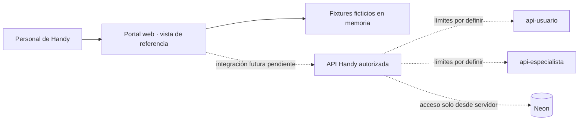

# Límites del sistema

## Estado observado

- `handy-internal-portal` es un repositorio separado. Al iniciar solo contenía `README.md` y `LICENSE`; no había aplicaciones, backend, API, contratos, CI ni configuración de publicación.
- Las apps de usuario y especialista son React Native bare + TypeScript. Este portal no las modifica ni las convierte a web.
- La landing de Handy está en otro repositorio y aporta tokens de marca y una referencia de tooling web.
- La arquitectura de backend de Handy documentada es Render + Neon con `api-usuario` y `api-especialista`. Este portal no accede a Neon desde el navegador.

## Límite actual

La aplicación tiene una interfaz `PortalDataSource` y una implementación exclusivamente local con fixtures ficticios. No hace solicitudes HTTP, no tiene sesión administrativa conectada y no persiste registros.

Las flechas punteadas describen una posibilidad futura, no contratos implementados. El servicio dueño y el contrato para cada lectura o escritura requieren TECH-03, TECH-06 y TECH-08.

## CI y publicación

El workflow `.github/workflows/pages.yml` corre lint, typecheck, tests y build, y publica una demo estática en GitHub Pages al actualizar `main`. El sitio es público y contiene únicamente fixtures ficticios; no tiene autenticación, API ni operaciones reales. Este preview no satisface el hosting del portal operativo: TECH-31 excluye GitHub Pages para uso comercial y la decisión de hosting final sigue pendiente.
